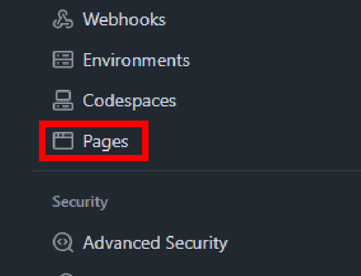
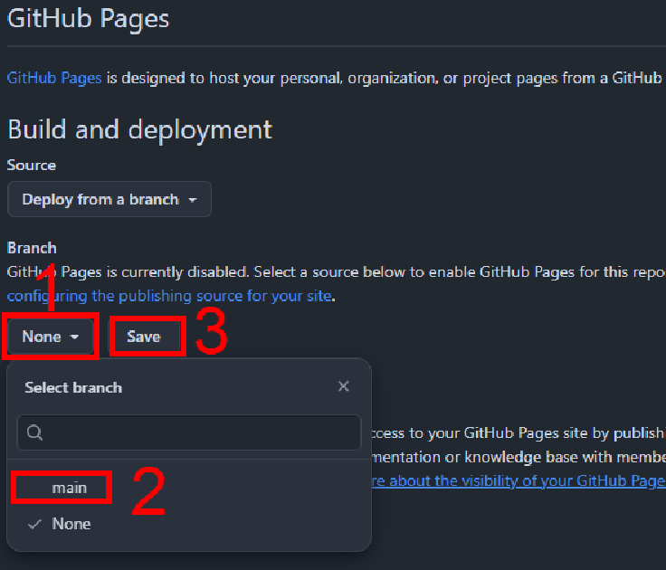

# GitHub Pages

How to setup GitHub Pages.

## 1. Go to Settings

Click the settings button\
\
then click the "Pages" section\

## 2. Set up

Set the source of the page, in this case the main branch\

## 3. Skip jekyll (Optional)

GitHub by default builds the page with jekyll but WebX does not need this.\
This can be skipped and make the build faster by creating a empty `.nojekyll` file in the root folder.

## 4. Done

The repo is now hosted on github pages.\
The URL of the site can be found at `https://<user name>.github.io/<repo name>`
